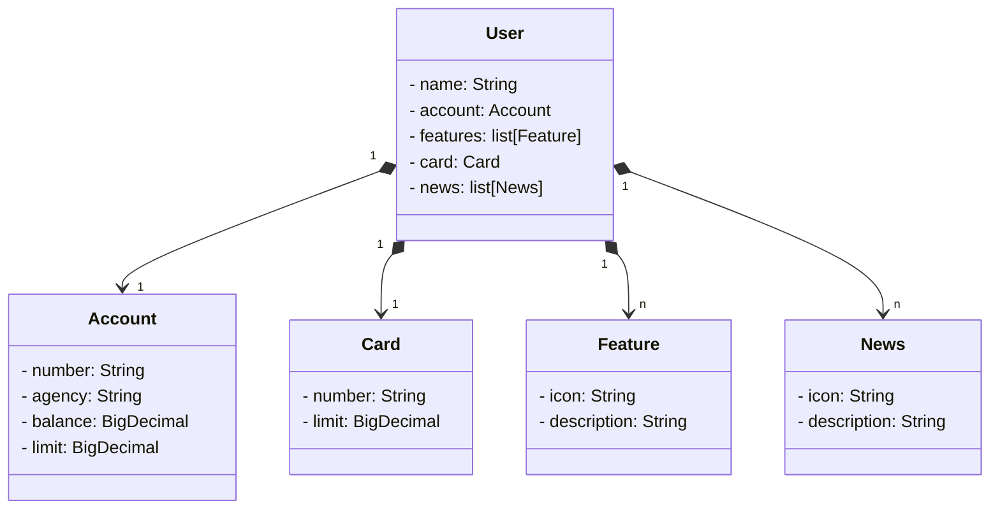

# Api RESTful cloud

## Descrição

Esta é uma API REST construída com Spring Boot, utilizando JPA Repository para persistência de dados. A aplicação é configurada para funcionar em dois ambientes: desenvolvimento e produção. No ambiente de desenvolvimento, a aplicação utiliza o banco de dados H2, enquanto no ambiente de produção utiliza o PostgreSQL. A API está documentada com OpenAPI e o deploy foi realizado via Railway.

## Funcionalidades

Essa API foi pensada para fornecer os dados para um sistema bancário, e suas funcionalidades permitem:

- Cadastro de usuários
- Consulta de usuários via id
- Consulta geral de usuários

#### Diagrama de Classes
O diagrama de classes a seguir descreve as principais classes do domínio da aplicação.

## Tecnologias Utilizadas

- **Spring Boot**: Framework principal para construção da API
- **JPA Repository**: Persistência de dados
- **H2 Database**: Banco de dados utilizado no ambiente de desenvolvimento
- **PostgreSQL**: Banco de dados utilizado no ambiente de produção
- **Railway**: Serviço de deploy e banco de dados na nuvem
- **OpenAPI**: Documentação da API

## Documentação da API

A documentação da API está disponível em `https://api-rest-cloud-production.up.railway.app/swagger-ui/index.html`. Esta documentação foi gerada utilizando OpenAPI e fornece detalhes sobre os endpoints disponíveis, incluindo exemplos de requisições e respostas.

## Licença

Este projeto está licenciado sob os termos da licença MIT.

---

Se precisar de mais alguma modificação ou detalhe adicional, estou à disposição!
